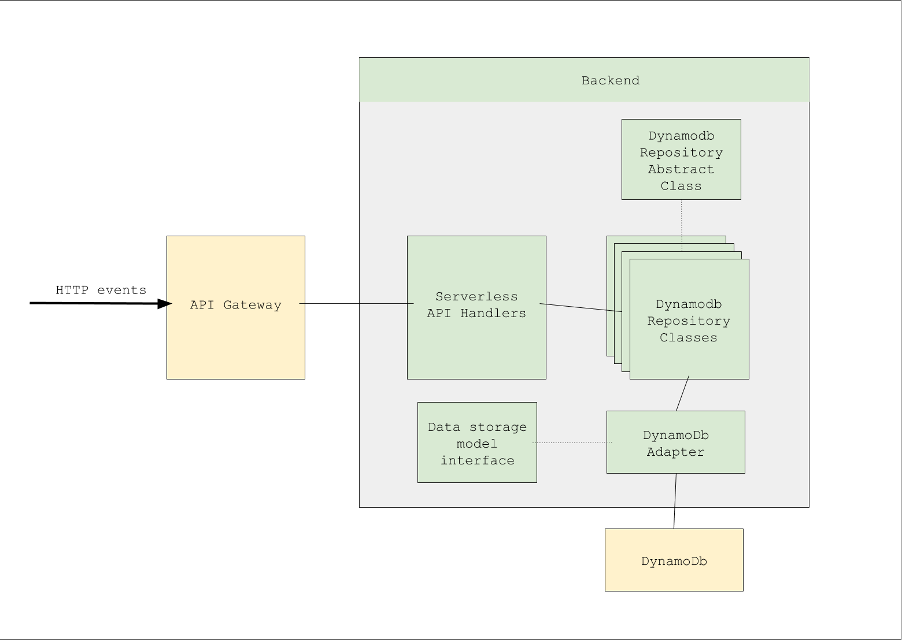

## Quickstart

```shell script
sh stop_dev.sh  # stops any running processes used in local development
sh run_dev.sh   # runs processes like dynamodb-local
pipenv shell    # starts shell
python data_dynamodb/create_tables.py --stage test --db_endpoint http://localhost:8000
```

## Create tables

`python data_dynamodb/create_tables.py --stage test`

where `test` is the stage name and a corresponding `config.test.json` should be found in the parent directory.

# Configuring Deployment

Before deploying, you might have to configure `config.{STAGE}.json`. Please refer to `config.example.json` also.

```json
{
  "AUTH0_DOMAIN": "https://neotheicebird.auth0.com",
  "AUTH0_AUDIENCE": "https://neotheicebird.auth0.com/api/v2/",
  "AUTH0_CLIENT_ID": "6e7A0uexZI8NRjM1U8QrB0YXXXXXXX",
  "AUTH0_CLIENT_SECRET": "-mKnxAwtSEzknTvbobIJ-PSRKWKlTYDjvTtTl9ddxSjq1_mI6P-XXXXXXXXXXXX",
  "AUTH0_CONNECTION": "Username-Password-Authentication"
}
```
To deploy, you can `cd` into `services` and deploy each service as follows:

```shell script
cd services
sls deploy -v --stage {STAGE}
cd idea
sls deploy -v --stage {STAGE}
cd ../user
sls deploy -v --stage {STAGE}
```
In future we can add scripts to automatically deploy all services.

To understand Auth0 params better check out the section below

# Configure Authentication and Authorization

1. Create an Auth0 account at auth0.com

2. While signing up, we would be creating a domain (e.g. `{account_name}.auth0.com`)

3. Under `Applications` to create new app, click on `Create Application` and give it a name (`{account_name}`). Select `Regular Web Application`.

4. Under the current app's `settings` scroll down and click on `Show Advanced settings` and click on `Certificates` to get the public key with which the serverless service is going to sign the tokens.
Copy the contents on signing `Signing Certificate` and paste in a local file named `public_key` in the `fdc-web-api` folder.

5. Click on `Grant Types` and check `Password`, `refresh token`, uncheck all the other grant types and save changes.

6. To configure the database to be used, click on `Connections > Database` and click on the default database `Username-Password-Authentication`. 
a. Settings like min and max password length, password policy, can be configured here.
b. Under applications tab we should see `{account_name}` enabled, if not please `enable` application.
c. clicking `Try connection` should work with a login screen.

7. To make password grant work, we have to set `Default Audience` and `Default Directory`, to do that:

a. Go to account settings (top right under your username)
b. On the general tab scroll down to the API Authorization Settings section
c. Default Audience would be your API identifier. This can be found under `APIs > Auth0 Management API`. `API Audience` is the identifier (`https://{account_name}.auth0.com/api/v2/`)
d. Default Directory would be your connection such as database connection name (`Username-Password-Authentication`)
e. Paste values and save.
Ref: https://stackoverflow.com/questions/41626602/how-to-make-a-username-password-request-with-auth0-custom-api-getting-error-un

8. CORS URLs: Under `Applications > {account_name} > Settings` scroll down to `Allowed Origins (CORS)` and enter any valid URL from which Auth0 endpoints are accessed (e.g `http://localhost:8080`).

# Design



# Conclusion

If there are any questions or problems in the future, please contact *Prashanth* at *neotheicebird@gmail.com*

## References:

Custom Authorizers: [https://www.alexdebrie.com/posts/lambda-custom-authorizers/](https://www.alexdebrie.com/posts/lambda-custom-authorizers/)

